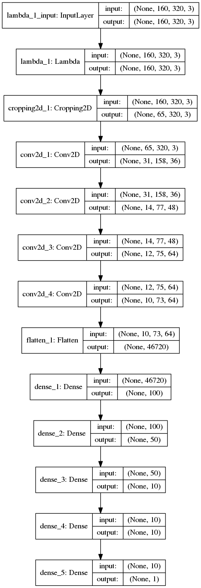

# **Behavioral Cloning** 

**Behavioral Cloning Project**

The goals / steps of this project are the following:
* Use the simulator to collect data of good driving behavior
* Build, a convolution neural network in Keras that predicts steering angles from images
* Train and validate the model with a training and validation set
* Test that the model successfully drives around track one without leaving the road
* Summarize the results with a written report


[//]: # (Image References)

[image1]: ./examples/placeholder.png "Model Visualization"
[image2]: ./examples/placeholder.png "Grayscaling"
[image3]: ./examples/placeholder_small.png "Recovery Image"
[image4]: ./examples/placeholder_small.png "Recovery Image"
[image5]: ./examples/placeholder_small.png "Recovery Image"
[image6]: ./examples/placeholder_small.png "Normal Image"
[image7]: ./examples/placeholder_small.png "Flipped Image"

## Rubric Points
### Here I will consider the [rubric points](https://review.udacity.com/#!/rubrics/432/view) individually and describe how I addressed each point in my implementation.  

---
### Files Submitted & Code Quality

#### 1. Submission includes all required files and can be used to run the simulator in autonomous mode

My project includes the following files:
* model.py containing the script to create and train the model
* drive.py for driving the car in autonomous mode
* model.h5 containing a trained convolution neural network 
* writeup_report.md or writeup_report.pdf summarizing the results

#### 2. Submission includes functional code
Using the Udacity provided simulator and my drive.py file, the car can be driven autonomously around the track by executing 
```sh
python drive.py model.h5
```

#### 3. Submission code is usable and readable

The model.py file contains the code for training and saving the convolution neural network. in addition to comments explaining how the code works.

### Model Architecture and Training Strategy

#### 1. An appropriate model architecture has been employed

The model is based on NVIDIA's [End-to-End Deep Learning for Self-Driving Cars](http://images.nvidia.com/content/tegra/automotive/images/2016/solutions/pdf/end-to-end-dl-using-px.pdf)

Keras was used to implement the pipline described in the paper, to split dataset as well and for training and validating the model.
Tensorflow was used as backend for Keras.

#### 2. Attempts to reduce overfitting in the model

The model was trained and validated on different data sets to ensure that the model was not overfitting.
In addition, the model was trained using slight random adjustment for steering angle when corresponding to an image from left/right front-facing camera.
The model was tested by running it through the simulator and ensuring that the vehicle could stay on the track.

#### 3. Model parameter tuning

The model used an adam optimizer with mean squared error loss function, so the learning rate was not tuned manually.

#### 4. Appropriate training data

Training data was chosen to keep the vehicle driving on the road. Data was augmented in a strategy similar to NVIDIA's making use of three front-facing cameras.

Input images were converted from RGB to YUV color space and were also cropped as shown in the class.

A new generator-based impelemntation was deveoped and tested.
The generator-based impelemntation was really slow, so wasn't suitable to try out several changes and wasn't really needed.

### Model Architecture and Training Strategy

#### 1. Solution Design Approach

Starting from NVIDIA's model, an implementaion for [End-to-End Deep Learning for Self-Driving Cars](http://images.nvidia.com/content/tegra/automotive/images/2016/solutions/pdf/end-to-end-dl-using-px.pdf) which incorporates several convolutional neural network layers, combined with ReLu activation layers, then several fully connected layers.

It's partially based on the implementation notes from:
https://github.com/Yunski/nvidia-cnn/blob/master/cnn.py
https://github.com/naokishibuya/car-behavioral-cloning/blob/master/README.md

Initially, the only modification was to add a fully connected layer producing one output which is used for steering.
In addition, input layer was subjected to normalization and cropping to reduce unncessary processing and memory resources.

Front facing center camera image and steering angle data was split into a training and validation set.
Training using adam optimizer with mean square error over 10 epochs resulted in validation loss less than 3%.
Running this model in autonomous mode was successful except in certain parts of the road where the car wasn't able to recover quickly to the center after taking a hard turn (especially if combined with a ramp).

To help the model generalize, the right and left camera images were used with steering angle adjusted randomly between 0.01-0.2 so that the model would generalize and recover the vehicle from the side of the road.
Switching to YUV color space like NVIDIA helped better steering in certain areas of the road.

Training with the extended data set of 19284 images over 10 epochs resulted in 1.39% validation loss.

Running the simulator to see how well the car was driving around track one, the vehicle is able to drive autonomously around the track without leaving the road (see video.mp4).
However, it wasn't able to drive track two where there are two lanes in the road and there is another road in the camera view (see video_track2.mp4).

One interesting approach was to combine all images from three facing front-cameras, it was implemented and showed better validation loss, however it was not useful with the simulator autonomous mode where only one camera is input.
So, this approach was discarded.

Additional training on partial track two driving (less than 5000 images) was showing overfitting after 6th epoch and with 15.46% validation loss.
This re-trained model wasn't expected to drive properly but the initial training helped the car drive most of this part (see video_track2_newdata.mp4).

More data needs to be collected for track two, but it's really tricky to drive even for me in the simulator.
In addition, more dropout layers need to be added to reduce overfitting.

#### 2. Final Model Architecture

The final model architecture consisted of NVIDIA's model described in "End to End Learning for Self-Driving Cars" with an additional fully connected layer with one output node.

The original architecture was visualized in the mentioned paper as follows:


Using the API `model.summary()` text description of the implemented architecture is obtained as follows:

```python
_________________________________________________________________
Layer (type)                 Output Shape              Param #
=================================================================
lambda_1 (Lambda)            (None, 160, 320, 3)       0
_________________________________________________________________
cropping2d_1 (Cropping2D)    (None, 65, 320, 3)        0
_________________________________________________________________
conv2d_1 (Conv2D)            (None, 31, 158, 36)       2736
_________________________________________________________________
conv2d_2 (Conv2D)            (None, 14, 77, 48)        43248
_________________________________________________________________
conv2d_3 (Conv2D)            (None, 12, 75, 64)        27712
_________________________________________________________________
conv2d_4 (Conv2D)            (None, 10, 73, 64)        36928
_________________________________________________________________
flatten_1 (Flatten)          (None, 46720)             0
_________________________________________________________________
dense_1 (Dense)              (None, 100)               4672100
_________________________________________________________________
dense_2 (Dense)              (None, 50)                5050
_________________________________________________________________
dense_3 (Dense)              (None, 10)                510
_________________________________________________________________
dense_4 (Dense)              (None, 10)                110
_________________________________________________________________
dense_5 (Dense)              (None, 1)                 11
=================================================================
Total params: 4,788,405
Trainable params: 4,788,405
Non-trainable params: 0
```

Keras Model visualization utility `plot_model` produces a graph utilizing  `graphviz` representing our implementation as follows:
```python
plot_model(model, to_file='model.png', show_shapes=True, show_layer_names=True)
```



#### 3. Creation of the Training Set & Training Process

Using the dataset provided with the resources, we used the center front-facing camera as input and steering angle as labels.
In addition, right and left front-facing camera images were used with steering angle adjusted randomly between 0.01-0.2 so that the model would generalize and recover the vehicle from the side of the road.
Input images were converted from RGB to YUV color space before training.

Also, during testing on Simulator with autonomous mode the camera image was converted from RGB to YUV color space before inferring the steering angle using the model.

Parameter for validation_split of 0.2 was used when training the model using Keras model.fit
Learning rate was automatically tuned using adam optimizer utilizing mean squared error loss function

The resulting training with the extended data set of 19284 images over 10 epochs resulted in 1.39% validation loss.

#### 4. Result on TestTrack-1
[Vehicle front Camera 60fps Video from the simulator](https://github.com/ahmedkhalaf/CarND-Behavioral-Cloning-P3/raw/master/run_1533_60fps.mp4)
